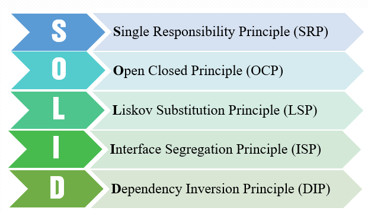
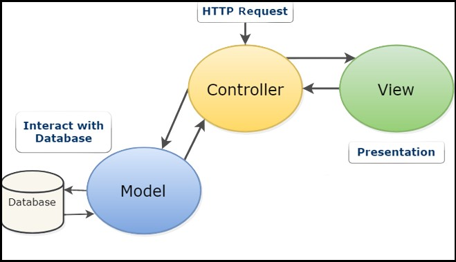

 #  [JAVA] BUỔI 11: CÁC NGUYÊN TẮC THIẾT KẾ, MÔ HÌNH THIẾT KẾ
 
 ***
## 1. SOLID là gì? (3 phần đầu)

>*Tài liệu tham khảo*:  [SOLID](https://levunguyen.com/craftmanship/2020/12/01/nguyen-ly-solid-trong-lap-trinh-java/)

>*Tài liệu tham khảo*:  [SOLID1](https://topdev.vn/blog/solid-la-gi/?utm_source=google&utm_medium=cpc&utm_campaign=topdev&utm_content=performance&gad_source=1&gclid=CjwKCAiA_5WvBhBAEiwAZtCU700RLrb0DfNJf1rrTIfVRNSgDI1MruzmD4P07Z9nXoUlySW4ts5e3hoCj8AQAvD_BwE)

>*Tài liệu tham khảo*:  [SOLID2](https://gpcoder.com/4200-cac-nguyen-ly-thiet-ke-huong-doi-tuong/)

\- **SOLID** là viết tắt của 5 chữ cái đầu trong 5 nguyên tắc thiết kế hướng đối tượng. Giúp cho lập trình viên viết ra những đoạn code dễ đọc, dễ hiểu, dễ maintain. Nó được đưa ra bởi Robert C. Martin và Michael Feathers. 5 nguyên tắc đó bao gồm:
-   **S**ingle responsibility priciple (SRP) - *Nguyên lý đơn chức năng* 
-   **O**pen/Closed principle (OCP) - *Nguyên lý đóng mở*
-   **L**iskov substitution principe (LSP) - *Nguyên lý thay thế*
-   **I**nterface segregation principle (ISP) - *Nguyên lý phân tách*
-   **D**ependency inversion principle (DIP) - *Nguyên lý đảo ngược phụ thuộc*

**Đây được xem là 5 nguyên lý hàng đầu trong việc thiết kế chương trình ở mức lớp và đối tượng**



\- Mục tiêu của những nguyên tắc này là tạo ra những sự thay đổi mã code ít ảnh hưởng các phần còn lại. Điều đó có nghĩa là khi sửa hoặc cải tiến code nên gây ra ảnh hưởng đến các phần còn lại càng ít càng tốt. Chúng ta giảm bớt chi phí bảo trì thông qua một thiết kế được thực hiện để thích ứng với thay đổi.

### 1.1: Single responsibility principle (SRP) – Nguyên lý đơn chức năng

\- Nguyên tắc này được phát biểu như sau: ***Một class chỉ nên giữ 1 trách nhiệm duy nhất, chỉ có thể sửa đổi class với 1 lý do duy nhất.***

\- Lợi ích của sử dụng nguyên lý này giúp chúng ta trong việc:

- Kiểm thử chức năng : Class chỉ có 1 nhiệm vụ nên việc test hoặc làm unit rất đơn giản chỉ cần vài testcase có thể kiểm tra được chất lượng code.

- Giảm phụ thuộc : Ít chức năng (method) trong class dẫn đến ít sự phụ thuộc.

- Tổ chức code của dự án : Các file code càng nhỏ thì dễ quản lý và tìm kiếm.

Ví dụ có lớp Book gồm có name, author và text.

```
public class Book {
    private String name,author,text;
    public String replaceWordInText(String word)
    {
        return text.replaceAll(word, text);
    }
    public boolean isWordInText(String word)
    {
        return text.contains(word);
    }
}
```
  - Lớp Book ở trên gồm có 2 phương thức là tìm kiếm từ trong đoạn văn (replaceWordInText) và kiểm tra xem từ đó có tồn tại trong đoạn văn không (isWordInText). Bây giờ ngoài việc tìm kiếm và kiểm tra thì thêm chức năng in ra màn hình. Thông thường trong lập trình sẽ viết thêm method in trong class Book như sau:*
```
public class Book {
    private String name,author,text;
    public String replaceWordInText(String word)
    {
        return text.replaceAll(word, text);
    }
    public boolean isWordInText(String word)
    {
        return text.contains(word);
    }
    void PrintText(){
        //............
    }
}
```

- Nếu viết code như trên thì chương trình vẫn chạy đúng nhưng đang vi phạm nguyên lý Single Responsibility. Vì lớp Book chỉ nên làm một nhiệm vụ và có trách nhiệm trong việc tìm kiếm và kiểm tra. Do vậy chức năng in phải di chuyển ra nơi khác và tạo một class khác chuyên cho việc in.

```
public class BookPrinter {

    void printText(String text) 
    {
        .........
    }
}
```
Như vậy nhiệm vụ in của class Book sẽ do lớp mới là BookPrinter đảm nhận và class BookPrinter này chỉ làm một việc duy nhất là in.

### 1.2: Open-Closed principle (OCP) – Nguyên lý đóng mở

Nguyên tắc này được phát biểu như sau:

***Có thể thoải mái mở rộng 1 class (bằng kế thừa), nhưng không được sửa đổi bên trong class đó.***

Ví dụ với code trên, khi ta muốn thêm thuộc tính ngày xuất bản vào class Book, thì ta phải xử dụng 1 class mới kế thừa thừ class Book

```
public class PublishedBook extends Book {
    private String publicationDate;

    public PublishedBook(String name, String author, String text, String publicationDate) {
        super(name, author, text);
        this.publicationDate = publicationDate;
    }

    public String getPublicationDate() {
        return publicationDate;
    }
}

```

\- Lợi ích:
  
-   Không cần phải test lại các class cũ 
-   Chỉ tập trung vào test các class mới
-   Dễ kiểm soát, tránh càng sửa càng loạn, càng sai

### 1.3: Liskov substitution principle (LSP) – Nguyên lý thay thế

Nguyên tắc này được phát biểu như sau:

***Trong một chương trình, các object của class con có thể thay thế class cha mà không làm thay đổi tính đúng đắn của chương trình.***

\- Nguyên lý này được hiểu như sau nếu lớp A là subtype của lớp B. Thì khi chúng ta thay lớp B bằng lớp A thì chương trình vẫn chạy đúng chức năng và nhiệm vụ. 

*Một lớp con được gọi là subtype của lớp cha khi nó kế thừa từ lớp cha đó và mở rộng hoặc thay đổi hoặc tái sử dụng các tính năng của lớp cha mà không làm thay đổi hành vi của lớp cha.*

## 2.KISS, DRY, YAGNI

### 2.1: KISS (Keep It Simple)

>*Tài liệu tham khảo*:  [KISS](https://topdev.vn/blog/kiss-principle-nguyen-tac-kiss-trong-java/)

\- Nguyên tắc KISS là giữ cho code của thật đơn giản, càng đơn giản, ngắn gọn càng tốt

\- Ở đây khi viết code, phải để người khác vừa đọc đã hiểu bạn đang viết cái gì, code của bạn thực hiện cái gì

```
//method 1
public static boolean isEven(int input) {
return (input & 1) == 0;
}
```

```
//method 2
public static boolean isEven(int input) {
return (input % 2) == 0;
}

```

Rõ ràng, method 1 nhanh hơn method 2 vì nó thực hiện trực tiếp với bit. Nhưng method 2 lại dễ hiểu hơn, người đọc không cần nhớ lại toán tử ‘&’ thực hiện như nào.

Ở đây  chọn method 2 vì nó dễ hiểu, rõ ràng. Còn method 1 có nhanh hơn nhưng tính tổng thể thì nó không nhanh hơn quá nhiều chỉ  tính bằng mini giây.

Khi áp dụng được nguyên tắc KISS rồi bạn sẽ thấy nó có rất nhiều lợi ích:

-   Các vấn đề được giải quyết nhanh hơn, tránh được các issue phức tạp
-   Code dễ sử dụng, dễ test
-   Bản thân code đã chính là tài liệu, comment cho chính nó
-   Và dễ dàng bảo trì, sửa lại code khi cần

### 2.2: DRY (Don’t Repeat Yourself)

>*Tài liệu tham khảo*:  [DRY](https://topdev.vn/blog/yagni-dry-la-gi-nguyen-tac-yagni-dry-trong-java/)

DRY: “Don’t Repeat Yourself” – Đừng bao giờ lặp lại code.

Đừng lặp lại code ở đây là không lặp lại các đoạn code giống nhau, các method thực hiện chức năng như nhau, cố gắng gom chúng lại 1 cách gọn gàng và có thể dùng lại khi cần.

Ta có 2 method

```
public void print(User user) {
System.out.println("first name: "+user.getFirstName());
System.out.println("last name: "+user.getLastName());
System.out.println("age: "+user.getAge());
System.out.println("email: "+user.getEmail());
System.out.println("address: "+user.getAddress());
System.out.println("gender: "+user.getGender());
System.out.println("exprience: "+user.getExperience());

 // do something: print user info
}
public void preview(User user) {
System.out.println("first name: "+user.getFirstName());
System.out.println("last name: "+user.getLastName());
System.out.println("age: "+user.getAge());
System.out.println("email: "+user.getEmail());
System.out.println("address: "+user.getAddress());
System.out.println("gender: "+user.getGender());
System.out.println("exprience: "+user.getExperience());

 // do something: review user
}
```

2 method trên thực hiện 2 chức năng khác nhau nhưng có rất nhiều code bị lặp lại, đây là case bị lặp code cơ bản ít người mắc phải. Ta có thể tránh lặp code trường hợp này bằng cách tách phần in thông tin user ra thành 1 method và gọi tới nó:

```
public void showUser(User user) {
System.out.println("first name: "+user.getFirstName());
System.out.println("last name: "+user.getLastName());
System.out.println("age: "+user.getAge());
System.out.println("email: "+user.getEmail());
System.out.println("address: "+user.getAddress());
System.out.println("gender: "+user.getGender());
System.out.println("exprience: "+user.getExperience());
}

public void print(User user) {
showUser(user);
 // do something: print user info
}
public void preview(User user) {
showUser(user);
 // do something: review user
}
```
Sau khi tách ra method showUser thì ta có thể dùng lại nó hoặc nếu cần chỉnh sửa, lỗi trong việc in ra thông tin user thì ta chỉ cần sửa method showUser là được.

### 2.3: YAGNI

>*Tài liệu tham khảo*:  [YAGNI](https://topdev.vn/blog/yagni-dry-la-gi-nguyen-tac-yagni-dry-trong-java/)


YAGNI: “You Aren’t Gonna Need It”: Bạn không cần nó.

Đôi khi mình nghĩ rằng cần phải thêm 1 số chức năng mới, mình nghĩ nó cần thiết, có thể sẽ dùng trong tương lai và mình làm nó. Hãy dừng lại, như thế là mình đang phạm phải sai lầm.

mình không nên lãng phí thời gian vì hành động đó, cái chức năng mà mình thêm mới đó có thể không làm ưng ý khách hàng hoặc cấp trên, thậm chí không bao giờ được dùng tới. Hãy confirm nó trước khi làm, và tập trung vào các task hiện tại thay vì đi làm 1 cái mới mà chưa chắc đã dùng tới rồi lại phải mất thêm công test nó.

## 3: Mô hình MVC

>*Tài liệu tham khảo*:  [MVC](https://lanit.com.vn/mo-hinh-mvc-trong-java-la-gi.html?fbclid=IwAR3iXjl5DwG-2SlFcVjbUG0I0BtQxRJcSk5DkJz2k2i3VYN4TwMW8r6DGwU)



### 3.1: Mô hình MVC trong Java là gì?

MVC được viết tắt từ Model View Controller. Đây là mô hình phần mềm dùng để tạo lập giao diện người dùng trên máy tính. Mô hình MVC bao gồm ba bộ phận chính là Model, View và Controller. Mỗi thành phần có chức năng, nhiệm vụ khác nhau nhưng giữa chúng có sự tương tác qua lại, hỗ trợ nhau. Trong đó:

- Model có chức năng quản lý và xử lý dữ liệu.
- View có nhiệm vụ hiển thị dữ liệu cho người dùng. 
- Controller có chức năng điều khiển tương tác giữa Model và View.

Mô hình MVC trong Java giúp lập trình viên dễ dàng tách biệt giữa cách thức dữ liệu nội hàm với dữ liệu hiển thị. Sự tương tác qua lại giữa ba thành tố Model, View, Controller tạo nên hiệu quả tốt nhất cho việc lập trình. 

### 3.2: Model

Một trong những thành phần quan trọng nhất của mô hình MVC trong Java. Đây là bộ phận làm nhiệm vụ quản lý dữ liệu. Model có chức năng vận chuyển thông tin từ nội hàm để hiển thị đến người dùng thông qua màn hình và xử lý các thông tin để người dùng dễ dàng tiếp cận nhất.

Model hoàn toàn độc lập với các thành phần còn lại trong MVC và nó chứa các tác vụ cần thiết nhất cho quá trình lập trình .

### 3.3: View

Thành phần tiếp theo chúng ta sẽ nhắc đến ở mô hình MVC trong Java, đó là View. Đối với người dùng thì View có vai trò thiết yếu. Nó thực hiện nhiệm vụ tạo tương tác với người dùng và hiển thị các kết quả từ tầng Controller. Đồng thời, View cũng thực hiện việc tiếp nhận các hoạt động, yêu cầu của người dùng để chuyển đến Controller xử lý.


Nói một cách dễ hiểu. Các thành phần trong MVC giống như một website. View chính là các trang giao diện hiển thị những gì mà người dùng nhìn thấy


### 3.4: Controller

Khi nhắc tới các thành phần ở mô hình MVC nhất định không thể bỏ qua Controller. Nếu không có thành phần này thì mọi hoạt động của Model hay View đều không còn giá trị.

Controller thực hiện chức năng kết nối tương tác giữa View và Model. Nó định nghĩa các lệnh và thực hiện xử lý các lệnh trong hệ thống. Controller đối chiếu hành động của người dùng từ View và tương tác với Model để chuyển tải thông tin cần thiết đến người dùng.

